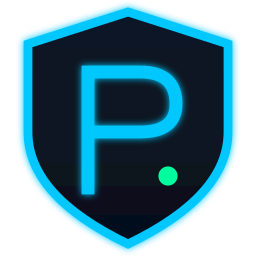

<p align="center">
  
</p>

<h1 align="center">Protek</h1>

<p align="center">
  Self-hosted CrowdSec → MikroTik bouncer + NOC dashboard.
  Banishes attackers at your perimeter, not just at nginx.
</p>

<p align="center">
  
  
  
  
  
</p>

---

## What is Protek?

Protek is a [CrowdSec](https://crowdsec.net) **bouncer for MikroTik routers**, with a NOC-style dashboard sitting on top. It pulls active decisions from one or more CrowdSec LAPIs, reconciles them into a MikroTik `address-list`, and gives you a single pane of glass showing who is being blocked, why, and where.

**The gap it fills:** CrowdSec ships first-party bouncers for nginx, iptables, Cloudflare, and a handful of others — but **not for MikroTik RouterOS**. Community projects exist but are scripts, not products. Protek is the polished version.

**The end-to-end value:**

```
attacker → nginx logs       → crowdsec parser → scenario fires → decision
                                                                    │
                                          ┌─────────────────────────┘
                                          ▼
                                 Protek polls LAPI
                                          │
                                          ▼
                            MikroTik address-list updated
                                          │
                                          ▼
                       firewall drops attacker at the WAN edge
                       (blocks them from EVERY service behind the router,
                        not just the one CrowdSec was watching)
```

Phase 2 will extend this with **cross-box decision federation** — let multiple CrowdSec instances across your fleet share decisions privately, with Protek as the hub.

---

## Why this exists

If you run CrowdSec on a single VPS, its decisions only protect that one VPS. If you have a home network behind a MikroTik with port forwards, services on other VPSs, or you'd just like one attacker to get banned across your entire infrastructure the moment they hit any of it — you need a bouncer that lives at the network edge. That's the MikroTik. Protek is the bridge.

---

## Status

**v1.1 shipped, v1.2 in flight.** Arcs 1–13 (phases 0–80) are complete: MVP,
federation, intelligence + enrichment, scenarios + rules, multi-bouncer
(MikroTik / pfSense / OPNsense / iptables / Cloudflare), observability,
operator QoL, extensibility, polish, intelligence v2, resilience, ecosystem,
and the 2.0-prep arc. Arcs 14 (Operator UX) and 15 (Production-grade ops)
are in progress — see [`ROADMAP.md`](ROADMAP.md) for the running plan and
[`MEMORY.md`](MEMORY.md) for the session-by-session log of what shipped
and what broke.

---

## Stack

```
Backend:   Python 3.12 · Flask · SQLite (WAL)
CrowdSec:  LAPI HTTP client (X-Api-Key bouncer auth)
MikroTik:  routeros_api library (lifted from pipsqueeze)
Frontend:  Jinja2 server-rendered HTML; Chart.js sparklines, Leaflet.js attacker map
Auth:      Username/password + TOTP 2FA, rate limiting, IP whitelist
Design:    Tactical dark NOC — electric cyan #00c8ff, neon green #00ff9d, deep navy
           Rajdhani + Share Tech Mono fonts (Google Fonts)
Deploy:    gunicorn + systemd + nginx (matches pipsqueeze/traverse pattern)
```

---

## Documentation

- [`CLAUDE.md`](CLAUDE.md) — instructions for Claude Code working in this repo
- [`CONTEXT.md`](CONTEXT.md) — architecture decisions and why
- [`SKILL.md`](SKILL.md) — domain primer: CrowdSec LAPI, bouncer model, RouterOS address-list mechanics
- [`ROADMAP.md`](ROADMAP.md) — phased build plan with acceptance criteria
- [`MEMORY.md`](MEMORY.md) — running log of what was built, fixed, and pending

---

## License

MIT
